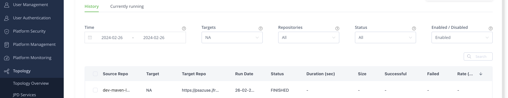

# Lab: Configure Push/Pull Replications

## Goals

Put in place a push and a pull replication

## Create a local maven repository in the source artifactory using the UI

Name it `<USERNAME>-test-maven-src-local`

## Create a local maven repository in the target artifactory using the UI

Name it `<USERNAME>-test-maven-target-local`

## Create a remote maven repository in the target artifactory using the UI

Name it `<USERNAME>-test-maven-target-remote`

## Push Replication
### Using the UI

1. Go in the Replication Properties of `<USERNAME>-test-maven-src-local` repository (Artifactory > Repositories > local > `Your repository` > Replications)
2. Select `+ Add Replication icon`
3. Complet mandatory field has done Here
1. Press `Test` (to check the connectivity) and `Save`
2. Enter a Cron Expression (to determines when the next replication will be triggered) `Ex: 0 15 10 * * ? *`
1. Select `Event replication`
2. Run the Replication
3. Check replication status (Platfom configuration > Topology > Replication)

### Pull replication

1. Go in the Replication Properties of `<USERNAME>-test-maven-src-remote` repository (Artifactory > Repositories > local > `Your repository` > Replications)
2. Change the URL with the artifactory url of `<USERNAME>-test-maven-src-local` (use the URL to file) fill `User Name` and `Password`
3. Press Test
4. Go on the `Replication` tab
5. Select `Enable Active Replication of this Repository`
6. Enter a Cron Expression (to determines when the next replication will be triggered) `Ex: 0 15 10 * * ? *`
7. Select `Event replication`
[Alt text](res/pull_repl.png)
8. Press `Test` (to check the connectivity) and `Save`
9. Run the Replication
10. Check replication status (Platfom configuration > Topology > Replication)
