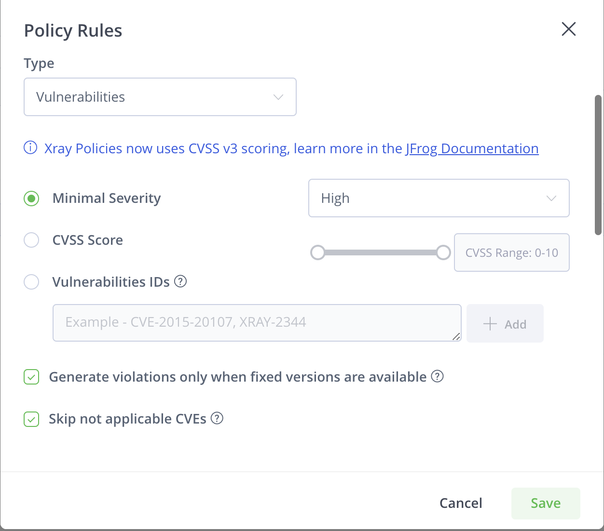

# Lab: JAS & IDE

## Goal

* Understand how JAS can help you prioritize the violation remediations
* How to start to shift left the security

## JFrog Advanced Security capabilities

Enable Contextual analysis on a docker repository
If you enable it on an already indexed repository, you'll have to enable the contextual analysis on demand per artifact.

## OPTIONAL - Configure the IDE plugin

1. Open IDE with source code
2. Install the JFrog extension / plugin on the IDE
3. Configure the connection to the JFrog Platform (CLI)
4. Trigger the scan (Refresh button) to display vulnerabilities (SAST + SCA)
5. Check the scan result
6. Prioritize the violation remediation by apply the following filtering

   

7. Set the watch in the IDE
8. Check the scan result
