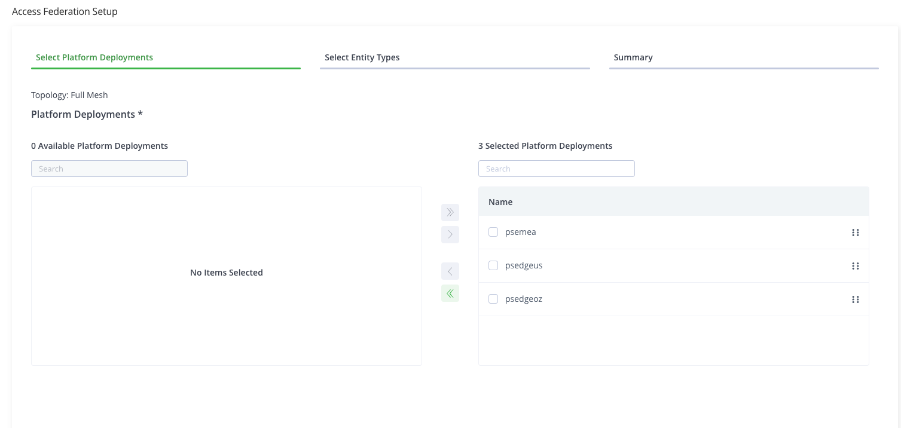
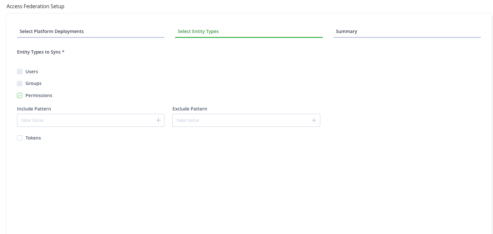
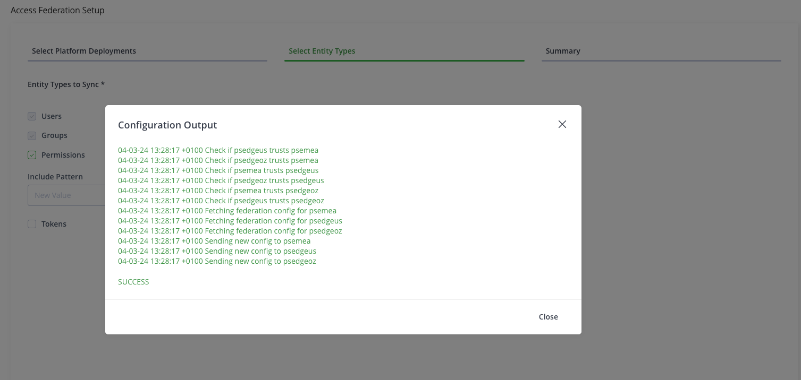

# Demo: Access federation

## Create Mesh topology

1. Open access federation tab (User Management > access_federation)
2. Select `Apply Topology` and select `Mesh`
3. Select Platforms to add in platform Deployement
  
4. Go in `Select Entity Types` and uncheck Tokens
  
5. Configuration Output is displayed
  
6. Go in another JPD create a user
7. Verify that the user is propagated 
