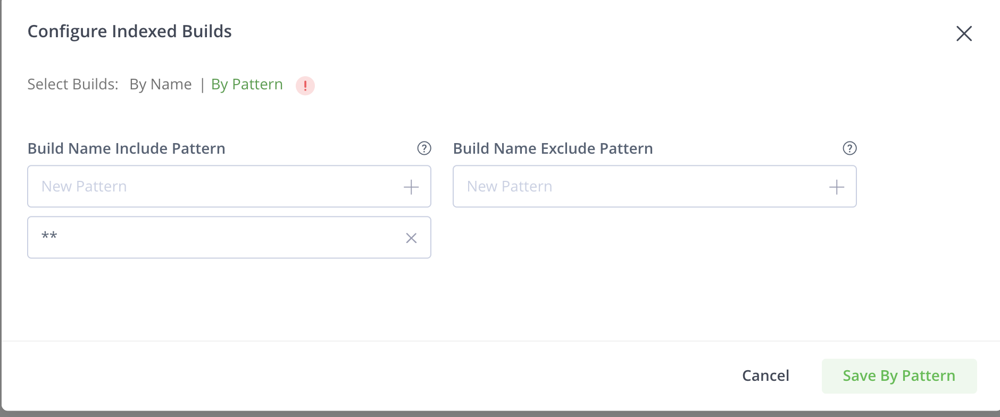
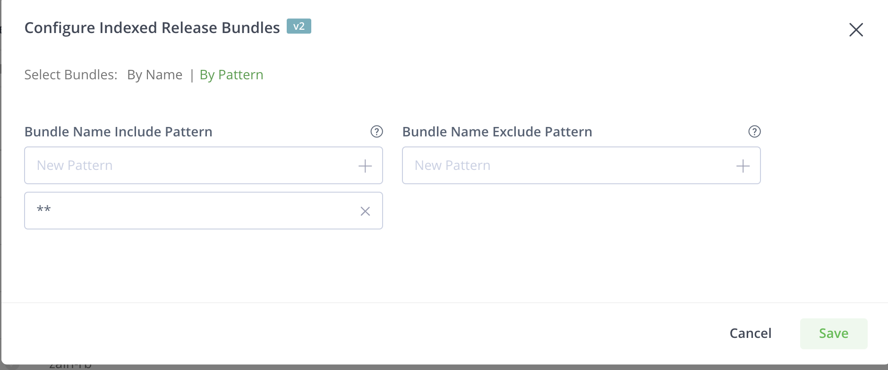

# Demo: Leverage JFrog BOMs continuous scanning

## Configure Build Info indexing in Xray

On the UI, go to  Xray > Indexed resources > Managed Builds


## Generate multiple Build Info in CI Pipeline

* This demo will show how to create a Build Info for an Application and its Containerized version to achiveve full traceability
* The Container Build Info can be then used to generate a Release Bundle V2

```bash
   cd ../../common/java

   MY_PROJ_KEY=""
   MY_IMAGE="<SAAS_DNS>/${MY_PROJ_KEY}-docker/java-app:1.0.0"
   export JFROG_CLI_BUILD_NAME=${MY_PROJ_KEY}-app JFROG_CLI_BUILD_NUMBER=1
   # export JFROG_CLI_BUILD_PROJECT=${MY_PROJ_KEY}
   
   ... 

   # build app + deploy + generate Application Build Info
   jf mvn clean package deploy

   # add complementary info to the Build Info
   # git hash, git branch
   jf bag 

   # environment variables
   jf bce
   
   # publish Application Build Info
   jf bp 

   echo "*****************************"
   echo "**** CONTAINERIZE APP"  
   echo "*****************************"

   ...

   echo "*****************************"
   echo "**** PUSH IMAGE TO ARTIFACTORY WITH BUILD INFO"  
   echo "*****************************"

   # init Container Build info + populate "artifact" section of the Container Build info
   jf docker push $MY_IMAGE \
      --build-name="${JFROG_CLI_BUILD_NAME}-container" \
      --build-number=${JFROG_CLI_BUILD_NUMBER}

   # add application as a dependeny of the Container Build Info
   jf bad "./target/*.war" "${JFROG_CLI_BUILD_NAME}-container" ${JFROG_CLI_BUILD_NUMBER}

   # publish Container Build Info
   jf bp "${JFROG_CLI_BUILD_NAME}-container" ${JFROG_CLI_BUILD_NUMBER}

```

## Configure RBv2 indexing in Xray

On the UI, go to  Xray > Indexed resources > V2 > Add a Release Bundle > By Pattern


## Generate a Release Bundle V2 in CI Pipeline

Generate a RBv2 from a Build Info.
see [Advanced BOM demo](../advanced-bom/README.md)
